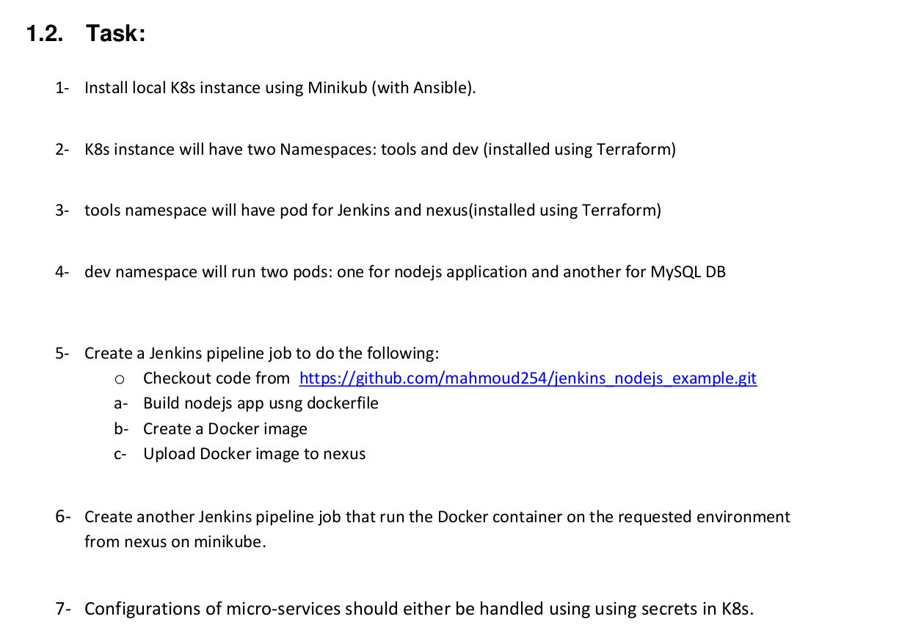
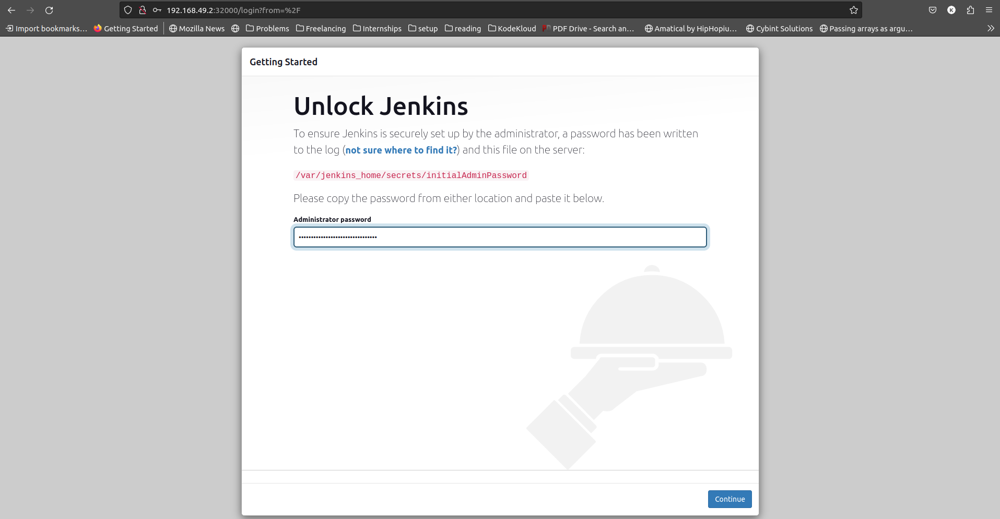
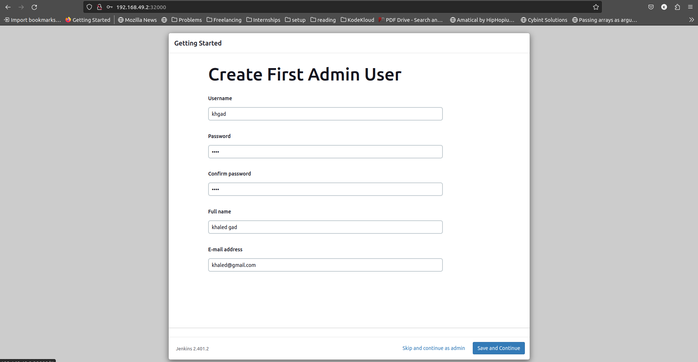
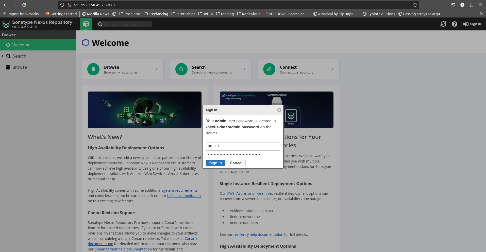
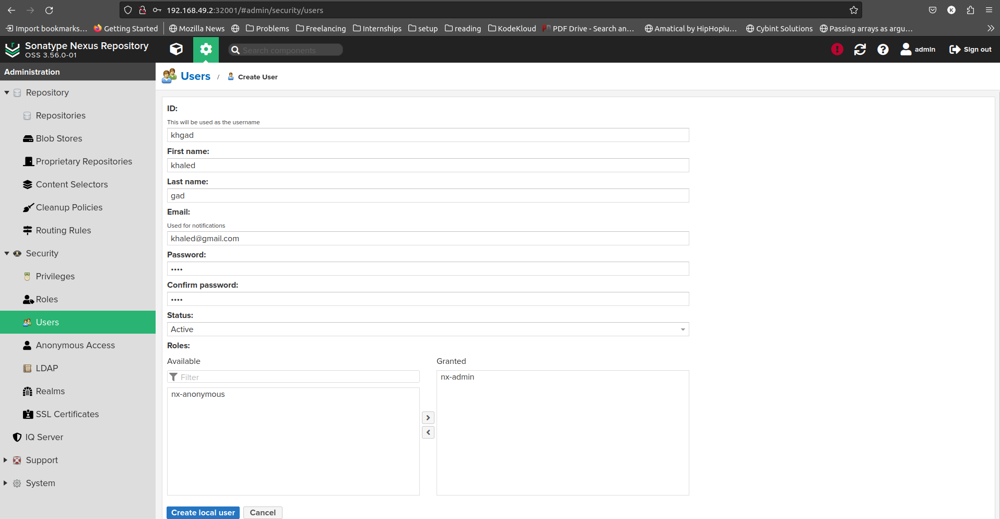
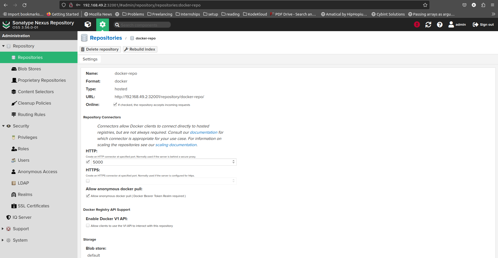

# ITI-graduation-project

## Project description

<div align="center">

</div>

## Steps

> We should prepare `provider.tf` before appling any terraform files.
### 2. K8s instance will have two Namespaces: **tools** and **dev**

By using terraform we created 2 namespaces (`tools` and `dev`) in [namespaces module](/terraform/namespaces).

### 3. Deploy pod for jenkins and nexus in `tools` namespace
    
We will create 2 modules for [jenkins](/terraform/jenkins/) and [nexus](/terraform/nexus/) which has the needed resources to run them.

**Jenkins configuration:**

1. get jenkins admin password:

```bash
kubectl exec -n tools <jenkins-pod-name> -- cat /var/jenkins_home/secrets/initialAdminPassword
```

<div align="center">

</div>
<br> 

2. setup username and password

<div align="center">

</div>
<br> 

**Nexus configuration:**

1. get nexus admin password:

```bash
kubectl exec -n tools <nexus-pod-name> -- cat /nexus-data/admin.password
```

2. login into nexus server

<div align="center">

</div>
<br> 

3. create new user

<div align="center">

</div>
<br> 

4. create new repository for docker

<div align="center">

</div>
<br> 

### 4. `dev` namespace will run two pods: one for nodejs application and another for MySQL DB

we have 2 deployment yaml files one for [nodejs]() and another for [MySQL DB]() that will be deployed in `dev` namespace through jenkins pipeline.
