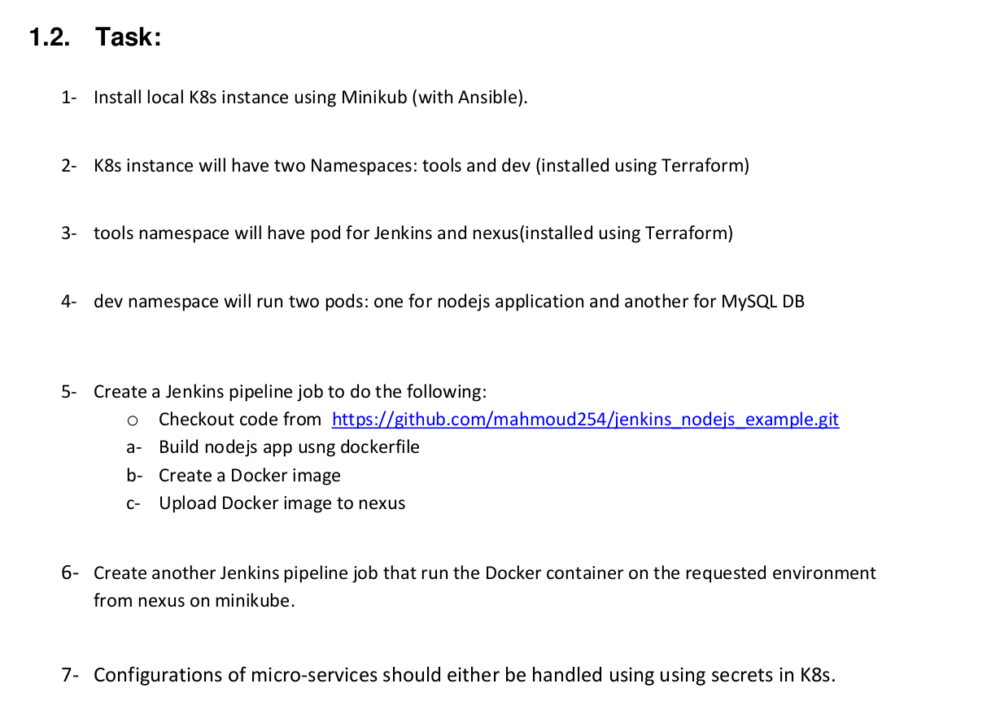
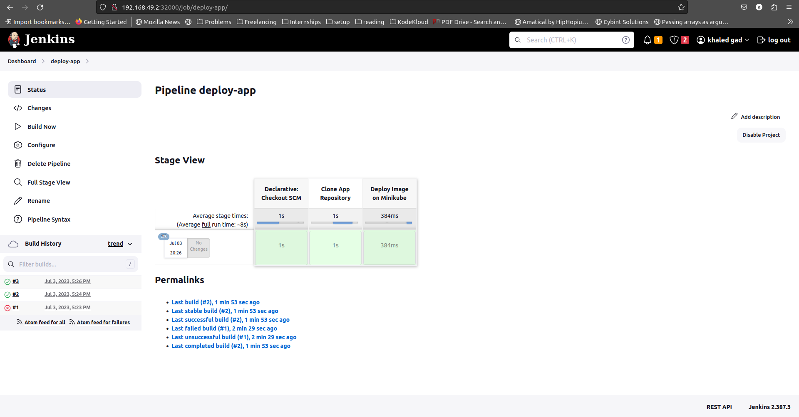

# ITI-graduation-project

## Project description

<div align="center">

</div>

## Steps

### 1. Install Minikube using Ansible

Making ansible [playbook](/ansible/playbook.yml) to install minikube and kubectl locally.

### 2. K8s instance will have two Namespaces: **tools** and **dev**

> We should prepare `provider.tf` before appling any terraform files.

By using terraform we created 2 namespaces (`tools` and `dev`) in [namespaces module](/terraform/namespaces).

### 3. Deploy pod for jenkins and nexus in `tools` namespace
    
We will create 2 modules for [jenkins](/terraform/jenkins/) and [nexus](/terraform/nexus/) which has the needed resources to run them.

**Jenkins configuration:**

> get jenkins admin password:

```bash
kubectl exec -n tools <jenkins-pod-name> -- cat /var/jenkins_home/secrets/initialAdminPassword
```

<div align="center">

</div>
<br> 

> setup username and password

<div align="center">

</div>
<br> 

**Nexus configuration:**

> get nexus admin password:

```bash
kubectl exec -n tools <nexus-pod-name> -- cat /nexus-data/admin.password
```

> login into nexus server

<div align="center">

</div>
<br> 

> create new user

<div align="center">

</div>
<br> 

> create new repository for docker

<div align="center">

</div>
<br> 

> Make Docker Bearer Token active in realms

<div align="center">

</div>
<br> 

### 4. `dev` namespace will run two pods: one for nodejs application and another for MySQL DB

we have 2 deployments, one for `nodejs` which will be deployed through jenkins pipeline and another for `MySQL DB` which will be deployed using terraform

we created terraform module for [mysql](/terraform/mysql/) which containt `deployment`, `service` and `secrets` resources.

another module for our [application](/terraform/app/) that contain `service` and `secrets`.

### 5. Jenkins pipeline to build the application

> Add credintials for nexus to login to docker repo in  nexus

<div align="center">

</div>
<br> 

> Make pipeline to build application

<div align="center">

</div>
<br> 

> Image is pushed to docker-repo in nexus

<div align="center">

</div>
<br> 

### 6. Jenkins pipeline to deploy the application

we will use this [deployment file](/app-manifests/deployment.yml) with the image we just pushed on docker-repo in nexus for our app to deploy on minikube in `dev` namespace 

<div align="center">

</div>
<br>

> app is deployed

<div align="center">

</div>
<br>

> app is running on nodeport `32300`

<div align="center">

</div>
<br>

> mysql is running on nodeport `32003`

<div align="center">

</div>
<br>

